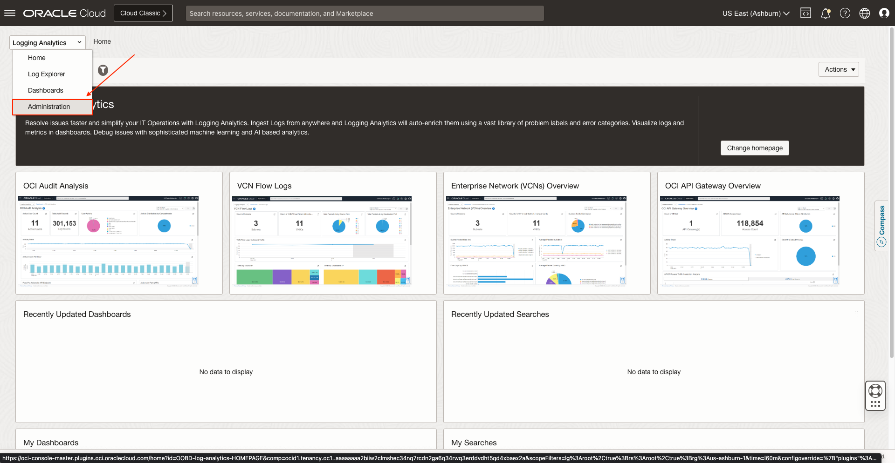

# DNS Exfiltration on Windows Systems

## Introduction

In this lab, you'll learn how to use problem labels and scheduled tasks together for creating more performant and sophisticated detection rules for alarms.

Log Name: Microsoft-Windows-DNS-Client/Operational
Event IDs: 3000 (Query), 3001 (Response)

Estimated Lab Time: 10 minutes

### Objectives

In this lab, you will:
* Label DNS query events in windows events
* Use query time lookup to verify DNS server by machines
* Create alarm per windows machine for DNS exfiltration

## **Task 1:**  Navigate to Log Explorer

1. Click on the **Log Explorer** option inside the drop-down menu.
   

2. Now you are in **Log Explorer**.
   

## **Task 2:**  Create a new Log Search

1. Type the following query in the text input: **'Entity Type' = 'Host (Windows)' and 'Log Source' = 'Windows System Events' | timestats count as logrecords by 'Log Source'**
   

2. Click on **Run** and see the results below.
   

## **Task 3:**  Save the Log Search

1. Specify the **Search Name** and the **Search Description (optional)**. Then, click on **Save** button.
   

  The log search is saved successfully.
   

## **Task 4:**  Navigate to Detection Rules

1. Click on the **Administration** option inside the drop-down menu to access to **Administration Overview**.
   

2. Click on the option **Detection Rules** inside **Resources** sidebar menu at the left.
   

  Now you are in **Detection Rules**.
   

## **Task 5:**  Create Scheduled search detection rule

1. In this lab you will use both **Scheduled search detection rule** and **Ingest time detection rule** for creating more performant and sophisticated detection rules for alarms.

  Click on **Create** inside **Detection Rules** page to start creating a new detection rule.
   

  First, we will create a **Scheduled search** type detection rule.
   

2. Specify a **Rule name** and **Saved search compartment**. Then, select the **Saved search** we created for the scheduled task.
   

3. Select **Monitoring** as **Target Service**. Specify a **Metric Compartment**, **Metric Namespace** and **Metric Name**. Finally, set the **Interval** to **1 Hours** and click on **Create detection rule**.
   

4. The detection rule is saved successfully.
   

## **Task 6:**  Navigate to Labels

1. Click on the option **Labels** inside **Resources** sidebar menu at the left.
   

2. Click on **Create** inside **Labels** page to start creating a new label.
   

## **Task 7:**  Create new Label

1. Specify the **Label** and **Description (optional)**.
   

2. Mark the **Use this label to indicate a problem** checkbox inside **Denotes Problem**. Then, select **High** for **Problem Priority**. Click on **Create**.
   

## **Task 8:**  Create Ingest time detection rule

1. Click on **Create** inside **Detection Rules** page.
   

2. Click on **Ingest time detection rule**.
   

3. Specify the **Rule name**. Select the **Label** we created and **Host (Windows)** for **Filter by entity type**.
   

4. Select **Monitoring** as **Target Service**. Specify a **Metric Compartment**, **Metric Namespace** and **Metric Name**. Finally, click on **Create detection rule**.
   

5. The detection rule is saved successfully.
   
## Acknowledgements
* **Author** - Oswaldo Osuna, Logging Analytics Development Team
* **Contributors** -  Kumar Varun, Logging Analytics Product Management - Kiran Palukuri, Logging Analytics Product Management - Vikram Reddy, Logging Analytics Development Team 
* **Last Updated By/Date** - Oct 18 2023
