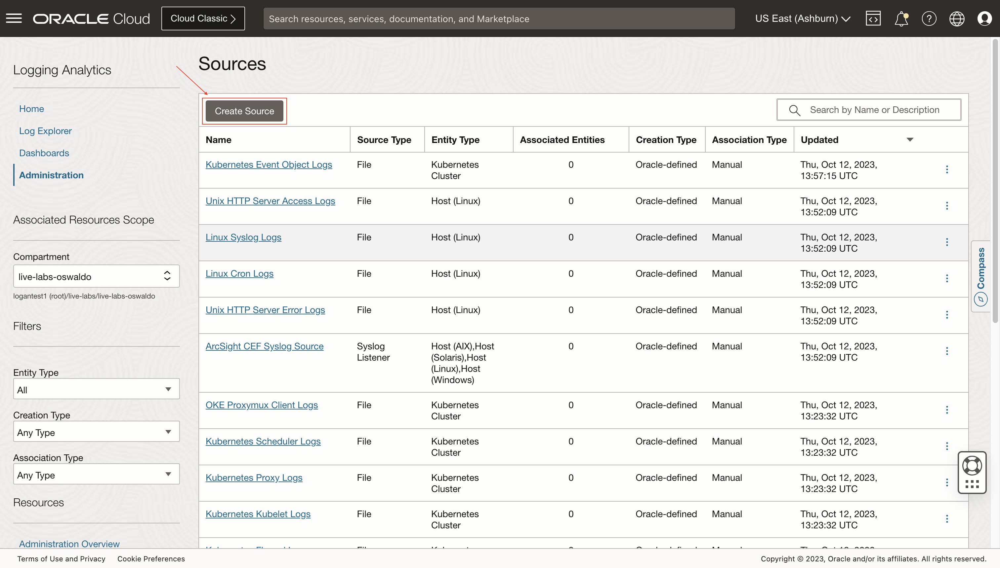
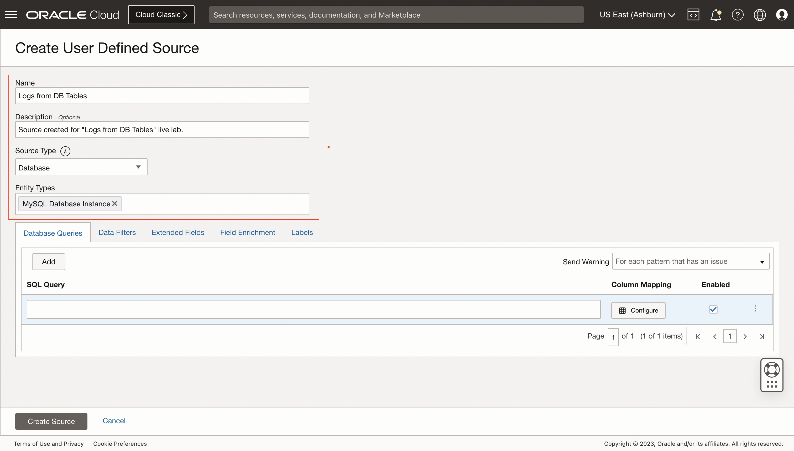

# Problem Labels for Custom Apps-Logs

## Introduction

In this lab, you'll learn how to use a SQL query to pull data from DB Table and ingest each row as a log-record
"SELECT name,total_mb*1024*1024 as total,free_mb*1024*1024 as free FROM v$asm_diskgroup_stat where exists (select 1 from v$datafile where name like '+%')".

Estimated Lab Time: 10 minutes

### Objectives

In this lab, you will:
* Understand how DB Table Log Collection works (Study)
* Learn how to create a DB SQL Log Source for an existing DB Entity
* Create alarm if available free space is 30% or less

## **Task 1:**  Navigate to Sources

1. Click on the **Administration** option inside the drop-down menu to access to **Administration Overview**.
   

2. Click on the option **Sources** inside **Resources** sidebar menu at the left.
   

  Now you are in **Sources**.
   

## **Task 2:**  Create User Defined Source

1. Click on **Create Source**.
   

2. Specify the **Name** and **Description (optional)**. Select **Database** as **Source Type**. Set **MySQL Database Instance** as **Entity Types**.
   

3. Click on **Database Queries** and add the following query: **SELECT name,total_mb*1024*1024 as total,free_mb*1024*1024 as free FROM v$asm_diskgroup_stat where exists (select 1 from v$datafile where name like '+%')**.
   

## **Task 3:**  Configure Column Mapping

1. Click on **Configure**.
   

2. For the **name** column, click on **Create New Field** button.
   

3. Specify a **Name**, select **String** for **Data Type** and specify a **Description (optional)**. Click on **Create**.
   

4. Do the same as **Step 3** for **total** and **free** columns.
   

5. Click on **Done**.
   

## **Task 4:**  Save User Defined Source

1. Click on **Create Source**.
   

   The source is saved successfully.
   

## Acknowledgements
* **Author** - Oswaldo Osuna, Logging Analytics Development Team
* **Contributors** -  Kumar Varun, Logging Analytics Product Management - Kiran Palukuri, Logging Analytics Product Management - Vikram Reddy, Logging Analytics Development Team 
* **Last Updated By/Date** - Oct 18 2023
