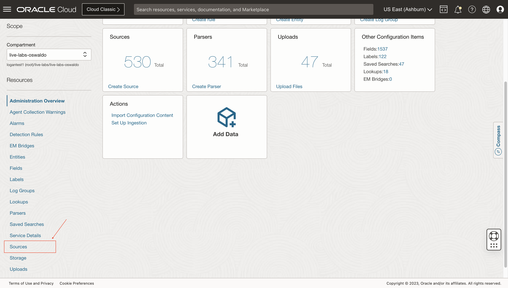
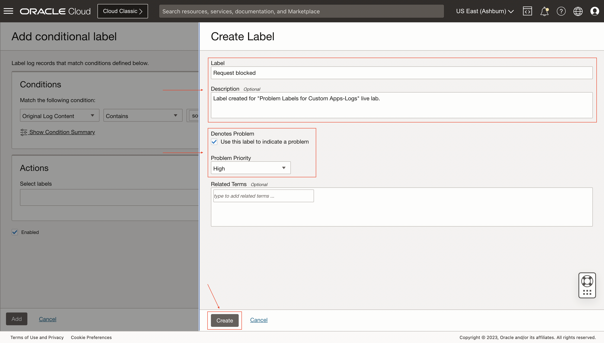
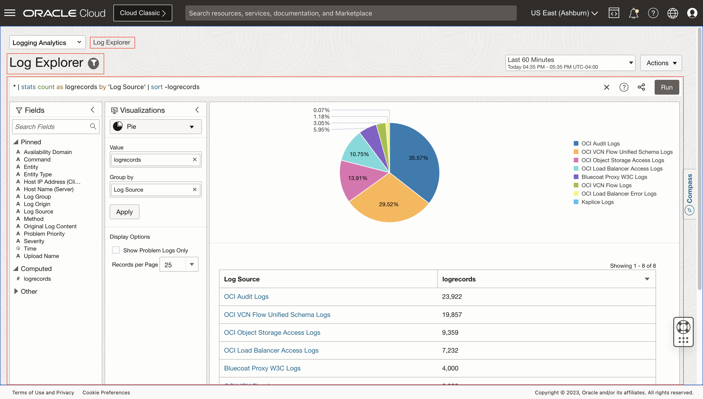
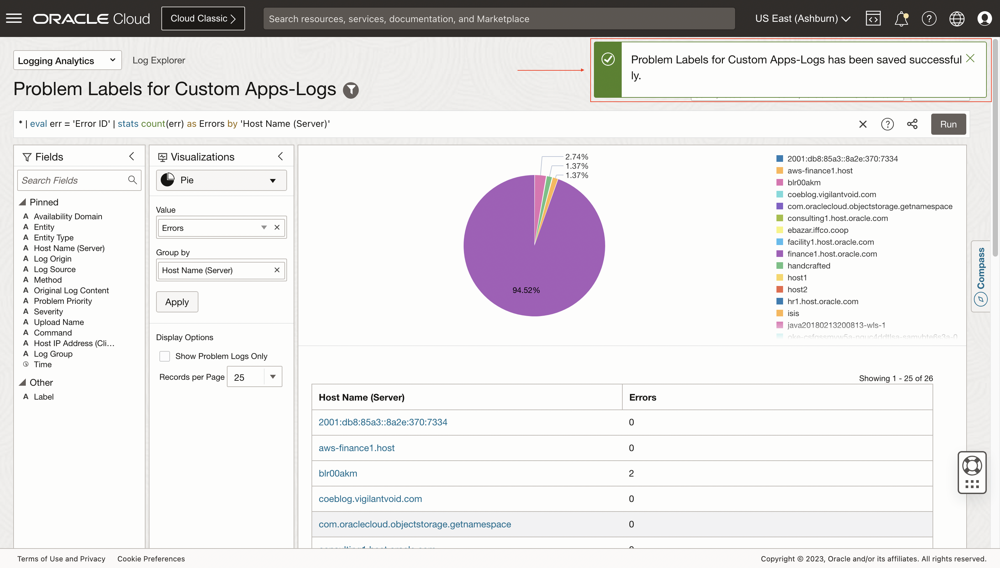
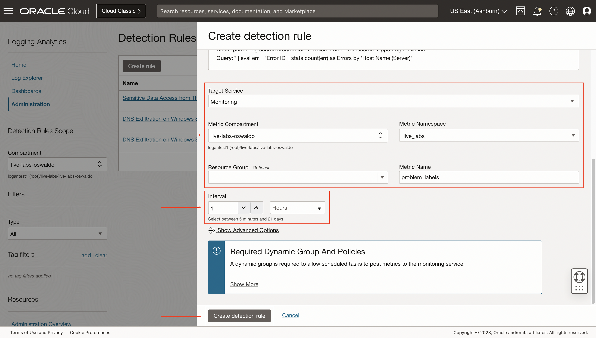
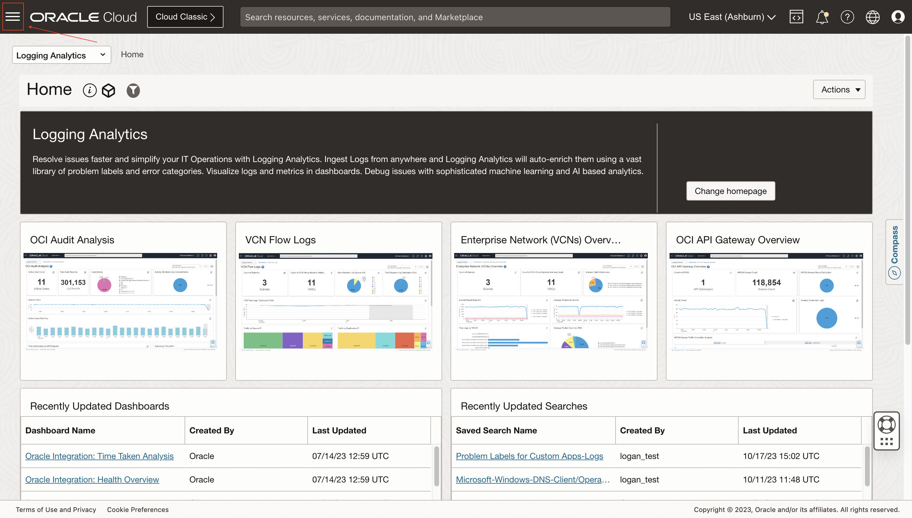
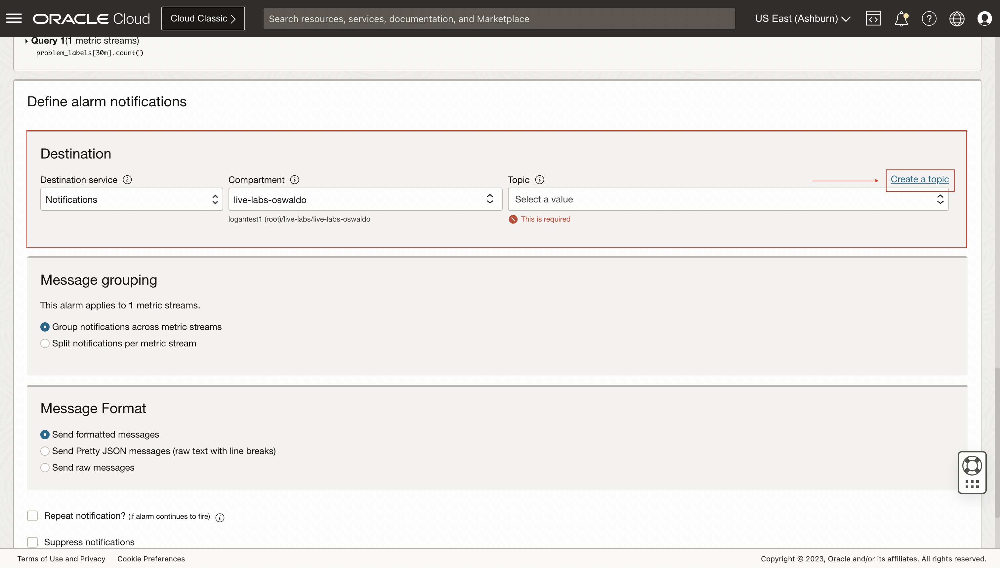

# Problem Labels for Custom Apps-Logs

## Introduction

In this lab, you'll learn best practices for proactively monitoring custom applications. You'll learn how to create custom problem labels, new fields (EFDs, query time).

Estimated Lab Time: 20 minutes

### Objectives

In this lab, you will:
* Extract new fields using eval, extract
* Create new labels & EFDs from log-explorer
* Create new labels, EFDs in a Log Source
* Create alarms on new labels and verify

## **Task 1:**  Navigate to Sources

1. Click on the **Administration** option inside the drop-down menu to access to **Administration Overview**.
   

2. Click on the option **Sources** inside **Resources** sidebar menu at the left.
   

  Now you are in **Sources**.
   

## **Task 2:**  Create User Defined Source

1. Click on **Create Source**.
   

2. Specify the **Name** and **Description (optional)**. Select **File** as **Source Type**. Select **Apache HTTP Server** at **Entity Types**.
   

3. Mark the **Specific parser(s)** option. Then, select **Apache HTTP Access Log Format**.
   

## **Task 3:**  Add Extended Fields

1. Click on **Extended Fields** and on **Add**.
   

2. Download sample logs file for [Log Sample](./files/log-sample.log) 
  Select **Original Log Content** as **Base Field**. Set the Log Sample for **Example Base Field Content**. For **Extract Expression** set **source ip:?\s{Source IP:[0-9]{1,3}\.[0-9]{1,3}\.[0-9]{1,3}\.[0-9]{1,3}}**.
   

3. Click on **Test Definition** and see more details about test results.
   

4. Click on **Add**.
   

5. The extended field definition is added successfully.
   

## **Task 4:**  Add Labels

1. Click on **Labels** and on **Add conditional label**.
   

2. Select **Original Log Content** as **Input Field** and **Contains** as **Operator**. Add **source ip** and **Request blocked** in **Condition Value**.
   

3. Click on **Create Label**.
   

4. Specify a **Label** and **Description (optional)**. Mark the **Use this label to indicate a problem** checkbox inside **Denotes Problem**. Then, select **High** for **Problem Priority**. Click on **Create**.
   

  The label is created successfully.
   

5. Click on **Add**.
   
   
  The conditional label is added successfully.
   

## **Task 5:**  Save User Defined Source

1. Click on **Create Source**.
   
   
  The source is created successfully.
   

## **Task 6:**  Navigate to Log Explorer

1. Click on the **Log Explorer** option inside the drop-down menu.
   

2. Now you are in **Log Explorer**.
   

## **Task 7:**  Create a new Log Search

1. For this lab, we are going to save a query using **eval** command to add new fields for custom logs. In this case, we want to add a new field that counts the number of errors for each host name (server).   
  Type the following query in the text input: *** | eval err = 'Error ID' | stats count(err) as Errors by 'Host Name (Server)'**
   

3. Click on **Run** and see the results below.
   

## **Task 8:**  Save the Log Search

1. Click on **Save as...** option inside **Actions** drop-down menu.
   

2. Select a **Saved Search Compartment**. Specify the **Search Name** and the **Search Description (optional)**. Then, click on **Save** button.
   

  The log search is saved successfully.
   

## **Task 9:**  Navigate to Detection Rules

1. Click on the **Administration** option inside the drop-down menu to access to **Administration Overview**.
   

2. Click on the option **Detection Rules** inside **Resources** sidebar menu at the left.
   

  Now you are in **Detection Rules**.
   

## **Task 10:**  Create Scheduled search detection rule

1. Click on **Create** inside **Detection Rules** page to start creating a new detection rule.
   

  We will create a **Scheduled search** type detection rule.
   

2. Specify a **Rule name** and **Saved search compartment**. Then, select the **Saved search** we created for the scheduled task.
   

3. Select **Monitoring** as **Target Service**. Specify a **Metric Compartment**, **Metric Namespace** and **Metric Name**. Finally, set the **Interval** to **1 Hours** and click on **Create detection rule**.
   

  The detection rule is saved successfully.
   

## **Task 11:**  Navigate to Alarm Definitions

1. Click on the navigation menu.
   

2. Click on **Observability and Management**. Then, click on **Alarm Definitions** inside **Monitoring**.
   

## **Task 12:**  Create Alarm

1. Click on **Create Alarm**.
   

2. Specify an **Alarm name** and select **Info** for **Alarm severity**. Specify an **Alarm body (optional)**.
   

3. Select a **Compartment**. Then, select the **Metric namespace** and **Metric name** we created for the **Detection Rules**. Set the **Interval** for **30 minutes**. Finally, select **Count** for **Statistic**.
   

4. Select the **Operator**, **Value** and **Trigger delay minutes**.
   

5. Click on **Create a topic**.
   

6. Specify a **Topic name** and **Topic description (optional)**. Select **Email** for **Suscription Protocol** and specify your email in **Subscription Email**. Click on **Create topic and subscription**.
   

7. Click on **Save alarm**.
   

  The alarm is saved successfully.
   

8. We should receive an email as result for the subscription.
   

## Acknowledgements
* **Author** - Oswaldo Osuna, Logging Analytics Development Team
* **Contributors** -  Kumar Varun, Logging Analytics Product Management - Kiran Palukuri, Logging Analytics Product Management - Vikram Reddy, Logging Analytics Development Team 
* **Last Updated By/Date** - Oct 18 2023
