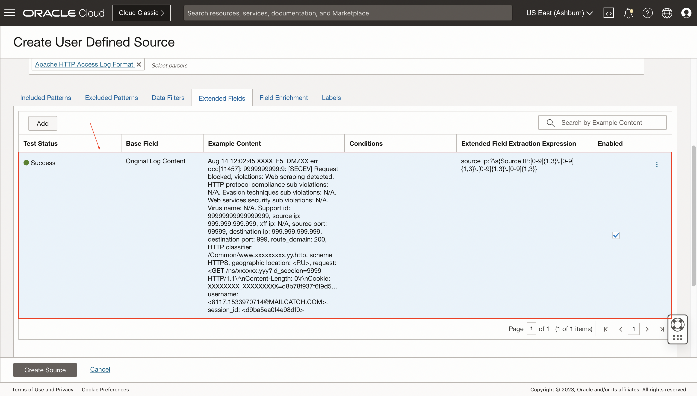
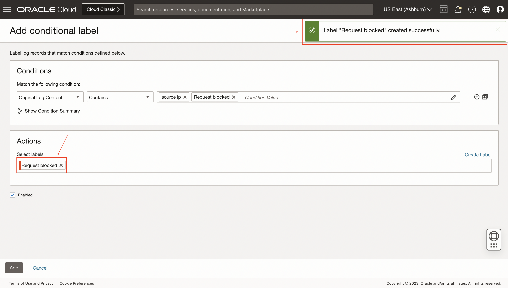
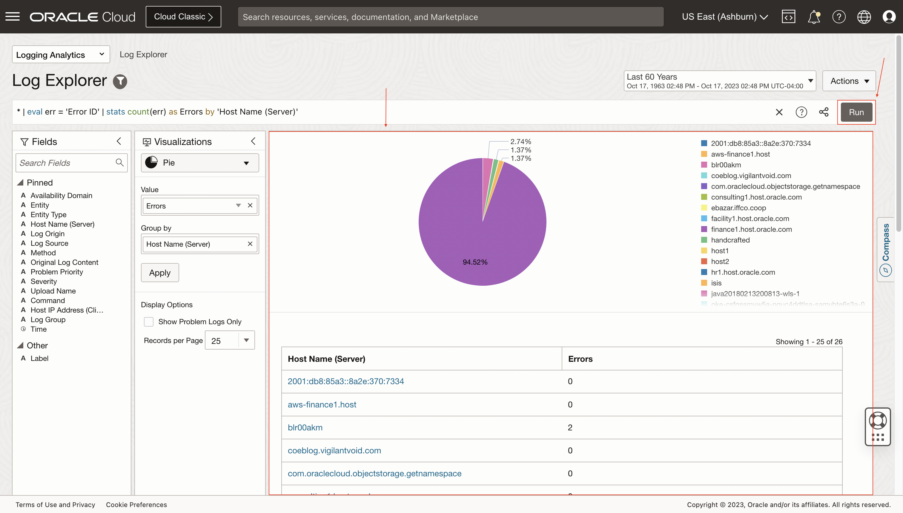

# Problem Labels for Custom Apps-Logs

## Introduction

In this lab, you'll learn best practices for proactively monitoring custom applications. You'll learn how to create custom problem labels, new fields (EFDs, query time).

Estimated Lab Time: 15 minutes

### Objectives

In this lab, you will:
* Extract new fields using eval, extract
* Create new labels & EFDs from log-explorer
* Create new labels, EFDs in a Log Source
* Create alarms on new labels and verify

## **Task 1:**  Navigate to Sources

1. Click on the **Administration** option inside the drop-down menu to access to **Administration Overview**.
   

2. Click on the option **Sources** inside **Resources** sidebar menu at the left.
   

  Now you are in **Sources**.
   

## **Task 2:**  Create User Defined Source

1. Click on **Create Source**.
   

2. Specify the **Name** and **Description (optional)**. Select **File** as **Source Type**. Select **Apache HTTP Server** at **Entity Types**.
   

3. Mark the **Specific parser(s)** option. Then, select **Apache HTTP Access Log Format**.
   

## **Task 3:**  Add Extended Fields

1. Click on **Extended Fields** and on **Add**.
   

2. Select **Original Log Content** as **Base Field**.  
  Download sample logs file for [Log Sample](./files/log-sample.log) 
  Set the Log Sample at **Example Base Field Content**.  
  For **Extract Expression** set **source ip:?\s{Source IP:[0-9]{1,3}\.[0-9]{1,3}\.[0-9]{1,3}\.[0-9]{1,3}}**.
   

3. Click on **Test Definition** and see more details about test results.
   

4. Click on **Add**.
   

5. The extended field definition is added successfully.
   

## **Task 4:**  Add Labels

1. Click on **Labels** and on **Add conditional label**.
   

2. Select **Original Log Content** as **Input Field** and **Contains** as **Operator**. Add **source ip** and **Request blocked** in **Condition Value**.
   

3. Click on **Create Label**.
   

4. Specify a **Label** and **Description (optional)**. Mark the **Use this label to indicate a problem** checkbox inside **Denotes Problem**. Then, select **High** for **Problem Priority**. Click on **Create**.
   

  The label is created successfully.
   

5. Click on **Add**.
   
   
  The conditional label is added successfully.
   

## **Task 5:**  Save User Defined Source

1. Click on **Create Source**.
   
   
  The source is created successfully.
   

## **Task 6:**  Navigate to Log Explorer

1. Click on the **Log Explorer** option inside the drop-down menu.
   

2. Now you are in **Log Explorer**.
   

## **Task 7:**  Create a new Log Search

1. Type the following query in the text input: **'Entity Type' = 'Host (Windows)' and 'Log Source' = 'Windows System Events' | timestats count as logrecords by 'Log Source'**
   

2. Click on **Run** and see the results below.
   

## Acknowledgements
* **Author** - Oswaldo Osuna, Logging Analytics Development Team
* **Contributors** -  Kumar Varun, Logging Analytics Product Management - Kiran Palukuri, Logging Analytics Product Management - Vikram Reddy, Logging Analytics Development Team 
* **Last Updated By/Date** - Oct 17 2023
