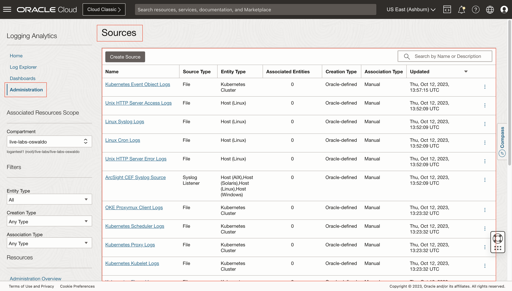
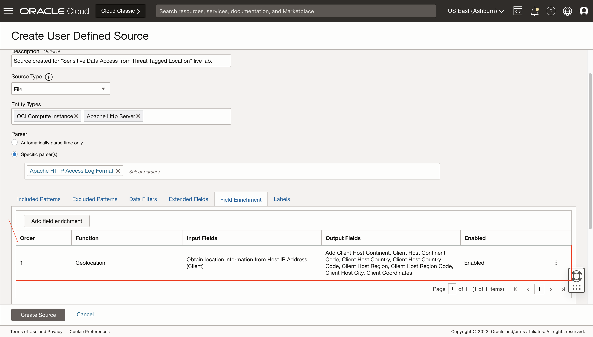
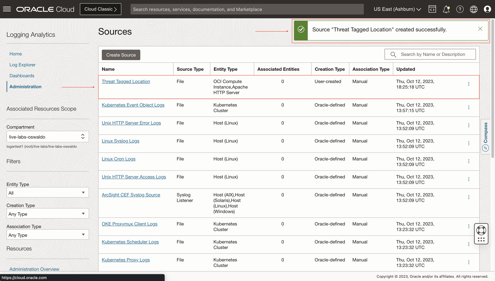
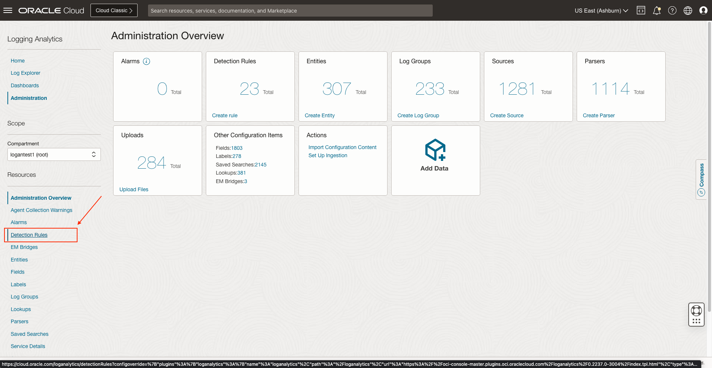
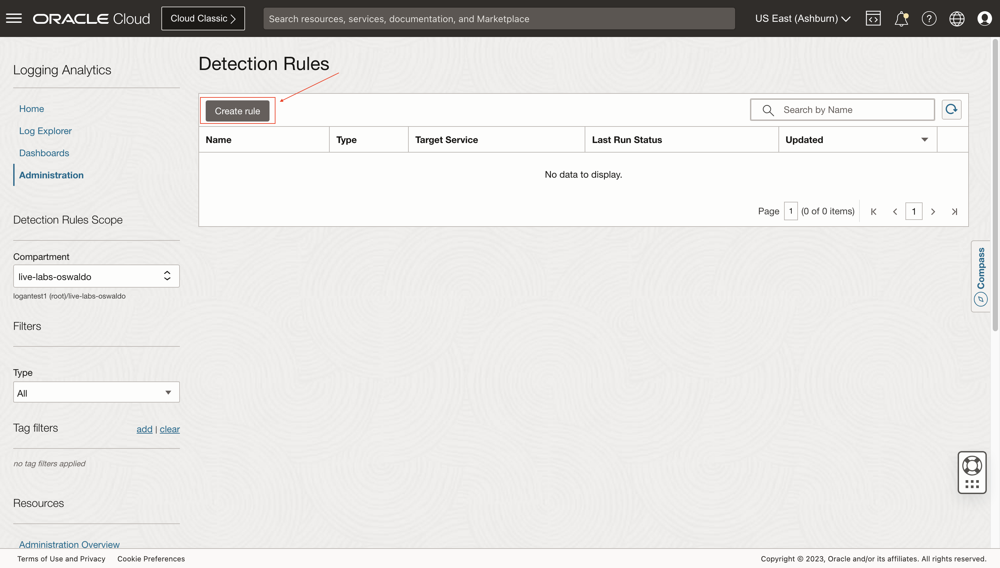

# Sensitive Data Access from Threat Tagged Location

## Introduction

In this lab, you'll learn how to create multi-conditional labels for creating more sophisticated ingest time detection rules based on Threat Intelligence Enrichment.

Estimated Lab Time: 15 minutes

### Objectives

In this lab, you will:
* Extend/Customize Log Sources
* Object Storage bucket or access to a system, web-access from a location tagged by TISS risky
* Create alarms and verify

## **Task 1:**  Navigate to Sources

1. Click on the **Administration** option inside the drop-down menu to access to **Administration Overview**.
   

2. Click on the option **Sources** inside **Resources** sidebar menu at the left.
   

  Now you are in **Sources**.
   

## **Task 2:**  Create User Defined Source

1. Click on **Create Source**.
   

2. Specify the **Name** and **Description (optional)**. Select **File** as **Source Type**. Set **OCI Compute Instance** and **Apache HTTP Server** as **Entity Types**.
   

3. Mark the **Specific parser(s)** option. Then, select **Apache HTTP Access Log Format**.
   

## **Task 3:**  Add Field Enrichment

Logging Analytics provides automatic threat intelligence enrichment for your logs that can help identify public IP addresses which could have some level of threat associated with them. Learning about the possible threats early can help separate and mitigate them.

To enable the threat intelligence enrichment feature, Geolocation Field is needed.

1. Click on **Field Enrichment** and on **Add field enrichment**.
   

2. Select **Geolocation** in **Function**. Then, Select **Host IP Address (Client)** in **IP Address Field** and mark **Threat Intelligence enrichment**. Finally, click on **Add field enrichment**.
   

  The field enrichment is added successfully.
   

## **Task 4:**  Create Multi-conditional label

1. Click on **Labels**, then on **Add conditional label**.
   

2. Select **Original Log Content** as **Input Field** and **Contains** as **Operator**. Add **threat** and **error** in **Condition Value**.
   

3. Click on the **Add a condition** button to make the label multi-conditional.
   

4. Select **Match all of the following conditions (AND)** in the drop-down above. Add the new condition with **Log Group** as **Input Field**, **Equal** as **Operator** and **live-labs** as the **Condition Value**.
   

5. Click on **Show Condition Summary** to check the multi-condition is correct.
   
   

6. Click on **Create Label**.
   

7. Specify a **Label** and **Description (optional)**. Mark the **Use this label to indicate a problem** checkbox inside **Denotes Problem**. Then, select **High** for **Problem Priority**. Click on **Create**.
   

  The label is created successfully.
   

8. Click on **Add**.
   

  The multi-conditional label is added successfully.
   

## **Task 5:**  Save User Defined Source
1. Click on **Create Source**.
   

  The source is created successfully.
   

## **Task 6:**  Navigate to Detection Rules

1. Click on the option **Detection Rules** inside **Resources** sidebar menu at the left.
   

  Now you are in **Detection Rules**.
   

## **Task 7:**  Create Ingest time detection rule

1. Click on **Create** inside **Detection Rules** page.
   

2. Click on **Ingest time detection rule**.
   

3. Specify the **Rule name**. Select the **Label** we created and **Monitoring** as **Target Service**.
   

4. Specify a **Metric Compartment**, **Metric Namespace** and **Metric Name**.
   

5. Click on **Create detection rule**.
   

  The ingest time detection rule is saved successfully.
   

## Acknowledgements
* **Author** - Oswaldo Osuna, Logging Analytics Development Team
* **Contributors** -  Kumar Varun, Logging Analytics Product Management - Kiran Palukuri, Logging Analytics Product Management - Vikram Reddy, Logging Analytics Development Team 
* **Last Updated By/Date** - Oct 12 2023
